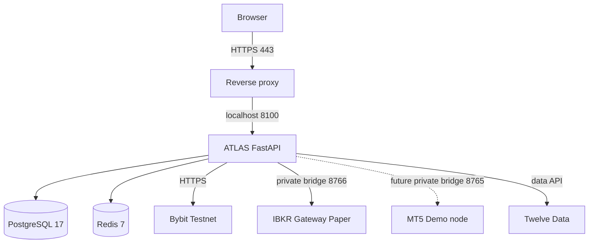

# ATLAS MARKETS — Architecture

Last updated: 2026-09-25
Target: v82 deployed multi-provider simulation plus v83 documentation closeout

## Product boundary

ATLAS MARKETS is a multi-market automated trading platform with a strict separation between analysis, risk approval, provider routing and execution. The current release line is for Simulation/Paper/Demo operation. Live Money remains separately gated.

## Markets and providers

| Market | Primary execution provider | Current environment | Status |
|---|---|---|---|
| FX | Fusion MT5 | Demo | certified automatic execution |
| Metals | Fusion MT5 | Demo | certified automatic execution |
| Commodities | Fusion MT5 | Demo | certified automatic execution |
| Stocks | IBKR | Paper | certified automatic execution with safeguards |
| ETFs | IBKR | Paper | certified automatic execution with safeguards |
| Crypto | Bybit | Testnet / Demo Spot | certified automatic execution with managed-inventory safeguards |
| Market/historical data | Twelve Data | data-only | connected; never execution |

## High-level topology

The broker bridges are not public web services. They must be reachable only through a trusted private network/VPN and should use bridge tokens plus host firewall rules.

## Application layers

### 1. Browser frontend

The FastAPI application serves the responsive ATLAS web UI. Major operational surfaces include Dashboard, Automation Operations Center, Integrations, Symbols & Strategies, Orders/action history, Performance, Risk, Users and System.

The Automation Operations Center is the canonical place to inspect:

- engine enabled/killed state;
- simulation execution state;
- scan schedule;
- certified and blocked routes;
- strategy-mode counts;
- latest actions and reasons;
- broker positions;
- unified P&L;
- release readiness.

### 2. API/auth layer

FastAPI exposes authenticated routes with two application roles only:

- `ADMIN`: full platform administration.
- `USER`: own/account-scoped data only.

Bearer access tokens and revocable user sessions are persisted. Public self-registration remains disabled.

### 3. Market and intelligence layer

Inputs include provider-native prices/candles, Twelve Data, historical storage and news intelligence. Deterministic technical analysis and historical/news context feed the strategy decision process.

### 4. Strategy layer

`SymbolStrategy` is the per-symbol control plane. Modes:

- `WATCH` — observe only.
- `SIGNALS` — compute/show signals but do not execute.
- `AUTO_TRADE` — eligible for automatic execution after all safety/provider gates pass.

The ADMIN bulk-promotion endpoint handles **eligible certified simulation routes only**. It can seed/promote MT5 Demo, IBKR Paper, and Bybit Testnet/Demo Spot symbols while never bulk-promoting Live Money.

### 5. Risk/preflight layer

Every execution candidate passes preflight before broker submission. Existing controls include:

- provider/environment certification;
- account enabled/active/connected/credentials state;
- strategy mode;
- per-trade risk sizing;
- whole-share IBKR sizing validation;
- maximum open-position/portfolio rules;
- same-symbol existing-position guard;
- duplicate/open-order guard;
- required MT5 SL/TP protection;
- IBKR WhatIf preflight;
- kill switch;
- separate Live Money gate.

A `BLOCK` or `SKIP` is often a successful safety decision, not an application failure.

### 6. Execution layer

#### Fusion MT5 Demo

ATLAS communicates with `tools/mt5_bridge.py`, which communicates with the running MetaTrader 5 terminal. Automatic Demo execution is certified.

#### IBKR Paper

ATLAS communicates with `tools/ibkr_bridge.py`, which communicates with TWS/IB Gateway. Automatic Paper execution is certified with:

- simulation-only bridge requirement;
- WhatIf preflight;
- max 1 share/order certification cap;
- duplicate position/order guards;
- post-submit broker status polling;
- cancelled orders recorded as `CANCELLED`, not falsely as executed.

For broad stock/ETF automation, real-time U.S. market-data subscriptions are recommended. IBKR delayed data is useful for analysis but should not be treated as execution-quality real-time data.

#### Bybit Testnet

Private API diagnostics, wallet, account permissions, controlled Spot execution, and broker-fill verification pass. Testnet/Demo Spot is a certified simulation route. BUY sizing uses Bybit instrument metadata, and SELL execution is restricted to persisted ATLAS-managed inventory. Before submission, the managed quantity is reconciled to the broker's available base-asset balance and rounded down to the exchange quantity step. Per-symbol execution failures are isolated so one rejected symbol does not fail an entire scan. Bybit Live remains uncertified and gated.

### 7. Automation/audit layer

`safe_automation_loop` runs continuously when enabled. It persists:

- one `AutomationScan` per cycle;
- one `AutomationAction` per symbol decision/preflight/execution result.

Execution policy is `CERTIFIED_ROUTES_ONLY`.

### 8. Reporting/performance layer

Unified performance reads broker-native history and account state. Strategy attribution is conservative: only activity with sufficiently verified ATLAS-to-broker lineage is called ATLAS-verified strategy performance.

### 9. Shadow intelligence layer

The non-executable shadow worker evaluates every enabled symbol strategy against its configured provider. It persists provider-attributed observations, meaningful skips and errors. Outcomes settle on the first available candle at or after the configured horizon and include costs, favorable/adverse excursion, expectancy, profit factor and path drawdown. Analytical eligibility never authorizes paper or live execution.

## Database

PostgreSQL 17 is the durable state store. Redis is the transient/cache coordination service. See `ERD.md` for logical persistence relationships.

## Oracle production layout

The Oracle profile is `docker-compose.oracle.yml`:

- FastAPI binds only to `127.0.0.1:8000`.
- PostgreSQL and Redis remain private to the Docker network.
- persistent volumes are enabled.
- all services use `restart: unless-stopped`.
- `.env.oracle` is private and never committed.
- public access should terminate at HTTPS 443 through a reverse proxy/load balancer.

Production currently uses `docker-compose.oracle.prod.yml` as the host-specific deployment asset; the tracked `docker-compose.oracle.yml` remains the canonical template. See `ORACLE_DEPLOYMENT.md` and `OPERATIONS_RUNBOOK.md`.

## Security boundary

Never expose these publicly:

- PostgreSQL 5432
- Redis 6379
- FastAPI 8000 directly
- MT5 bridge 8765
- IBKR bridge 8766

Provider API credentials are stored encrypted in BrokerProfile credential fields. Source control contains templates only, never real secrets.

## Live Money boundary

Moving to Oracle, enabling AUTO_TRADE, or achieving several profitable simulation weeks does not automatically authorize Live Money. Live Money requires a separate certification plan, deliberately smaller risk limits, provider-specific validation and an explicit configuration change from `ALLOW_LIVE_TRADING=false`.
