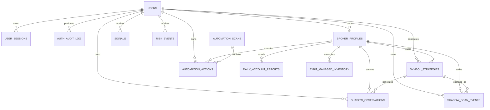
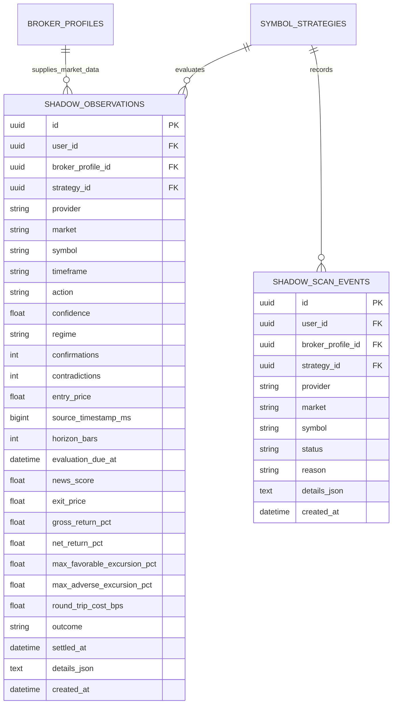

# ATLAS MARKETS — Production ERD

Last updated: 2026-09-25
Database head: `20260925_0019`
Release: v82 provider-aware shadow analytics

## Ownership and operational relationships

## Primary entities

| Entity | Purpose | Important relationships |
|---|---|---|
| `users` | Authentication and ownership root; roles are `ADMIN` and `USER` only | Owns profiles, strategies, observations and audit records |
| `user_sessions` | Revocable authenticated sessions | Belongs to user |
| `auth_audit_log` | Login and security activity | Belongs to user when identity is known |
| `broker_profiles` | Provider account, environment, encrypted credentials, certification and synchronized balances | Belongs to user; routes strategies |
| `symbol_strategies` | Per-provider, per-market, per-symbol control plane | Belongs to user and broker profile |
| `automation_state` | Global engine, kill switch and scan interval | Singleton operational state |
| `automation_scans` | One record per automation cycle | Parent of actions |
| `automation_actions` | Durable decision, block, order and execution lineage | Links scan, user and broker profile |
| `signals` | BUY/SELL/HOLD analytical output | Belongs to user |
| `risk_profiles` | Global risk limits and default sizing | Referenced by risk services |
| `risk_events` | Durable risk blocks and warnings | Belongs to user |
| `historical_candles` | Normalized OHLCV history | Scoped by provider, market, symbol and timeframe |
| `historical_backtest_runs` | Parameters and results for historical tests | Scoped by instrument |
| `news_articles` | News evidence and sentiment | Matched to symbol context by services |
| `daily_account_reports` | Equity and P&L snapshots | Belongs to broker profile |
| `bybit_managed_inventory` | ATLAS-owned Bybit Spot inventory and reconciliation state | Belongs to broker profile |
| `shadow_observations` | Forward-only, non-executable strategy decisions and settled outcomes | Links user, broker profile and symbol strategy |
| `shadow_scan_events` | Provider-attributed observed/skip/error diagnostics | Links user, broker profile and symbol strategy |

## Shadow analytics entities

The unique constraint `(strategy_id, source_timestamp_ms)` prevents duplicate observations for the same strategy and source candle. Scan events explain meaningful observations, skips and provider/analysis errors. Repeated checks of an already-observed candle are not persisted, preventing unnecessary audit growth.

## Broker truth and attribution

Provider-native fills, positions, balances and P&L are authoritative broker truth. ATLAS calls an execution strategy-verified only when persistent action lineage matches the broker evidence. Historical broker activity without that lineage remains unverified rather than being attributed retroactively.

## Legacy compatibility

`paper_wallets`, `paper_positions` and `paper_orders` remain for migration compatibility. They are not substitutes for IBKR Paper, Bybit Testnet/Demo or MT5 Demo broker truth.

## Deletion behavior and retention

- User-owned operational rows use cascading foreign keys where deletion is supported.
- Production user deletion is an administrative, audited operation and should follow retention policy.
- Broker activity needed for financial/audit retention should be exported before removing a profile.
- Database backups must be tested before destructive lifecycle changes.

## Storage boundary

PostgreSQL 17 is durable storage. Redis is transient coordination/cache state and is not a financial system of record. PostgreSQL and Redis remain on the private Docker network; their ports are not published publicly.
