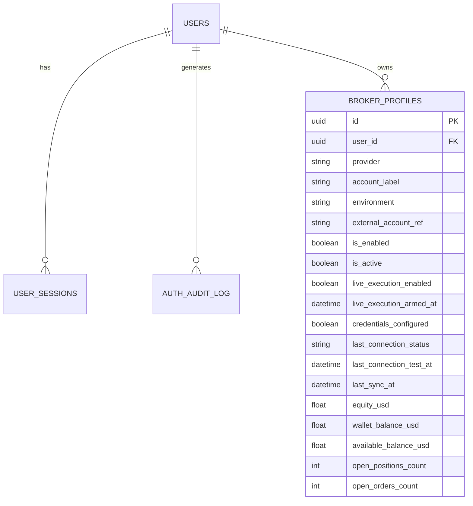

# ATLAS MARKETS — PostgreSQL Model / ERD Reference

Last reconciled: 2026-08-25.

## Important status

The original Phase 0 ERD was a target blueprint and no longer exactly matches the implementation. This document now distinguishes the **implemented model families** from longer-term domain targets so developers do not mistake proposed tables for deployed tables.

PostgreSQL remains the durable application store. UUID identifiers are used extensively, timestamps are stored with timezone-aware columns where defined, and user/account ownership is enforced through model relationships plus authorization logic.

## Current implemented model modules

The active branch currently contains these model modules under `app/db/models/`:

```text
auth.py
automation.py
broker.py
historical.py
news.py
paper.py
reporting.py
signal.py
strategy.py
symbol_strategy.py
```

`app/db/models/__init__.py` imports the active ORM model set for migration/application use.

## Core implemented relationship map



Additional implemented persistence families cover automation, historical intelligence/backtesting, news intelligence, paper trading, reporting, signals/decisions, strategy state and per-symbol strategy state. Refer to the ORM modules and migrations as the authoritative column-level schema.

## Authentication tables

The implemented authentication model includes:

- `users` — application identity, password hash, role and active state;
- `user_sessions` — server-side revocable session state;
- `auth_audit_log` — authentication/security audit events.

Only `ADMIN` and `USER` roles are valid application roles.

## Broker profiles — current implementation

`broker_profiles` is the current external-provider account model. Its UUID `id` is the logical broker profile identifier.

Implemented fields include:

- `id`
- `user_id`
- `provider`
- `account_label`
- `environment`
- `external_account_ref`
- `is_enabled`
- `is_active`
- `live_execution_enabled`
- `live_execution_armed_at`
- `last_connection_status`
- `last_connection_test_at`
- `api_key_encrypted`
- `api_secret_encrypted`
- `credential_blob_encrypted`
- `credentials_configured`
- `last_sync_at`
- `equity_usd`
- `wallet_balance_usd`
- `available_balance_usd`
- `open_positions_count`
- `open_orders_count`
- `created_at`
- `updated_at`

### Difference from the Phase 0 blueprint

The old ERD described a separate one-to-one `broker_credentials` table and a credential fingerprint column on `broker_profiles`. That is **not the current `BrokerProfile` ORM implementation**. Encrypted credential fields currently live directly on `broker_profiles`.

Future credential-schema hardening may revisit this design, but documentation must describe the deployed ORM/migrations until an actual migration changes it.

## Provider/account meaning

Current provider profiles represent external accounts/connections such as:

- IBKR Paper account `DUR980544`
- Fusion MT5 Demo login `448261`
- Bybit Testnet AI subaccount `107068845`

Twelve Data is market-data-only and should not be modeled/routed as an execution broker account when execution semantics are involved.

## Other implemented persistence families

### Automation

Automation models persist runtime/automation state needed by the automatic trading workflow. Exact fields are defined in `app/db/models/automation.py` and corresponding migrations.

### Historical intelligence

Historical models persist historical-learning/backtesting-related state introduced by the historical intelligence phases. See `app/db/models/historical.py`.

### News intelligence

News persistence exists in `app/db/models/news.py` for financial/news intelligence inputs and results.

### Paper trading

Paper-trading persistence exists in `app/db/models/paper.py` and supports internal simulated trading functionality separately from external-provider Paper/Demo accounts.

### Reporting

Reporting/performance persistence exists in `app/db/models/reporting.py`.

### Signals

Signal/decision persistence exists in `app/db/models/signal.py` and supports recorded strategy decisions/reasons/status information.

### Strategy and symbol strategy

Strategy state is implemented in `app/db/models/strategy.py`, with per-symbol/adaptive strategy state in `app/db/models/symbol_strategy.py`.

## Longer-term domain targets

The architecture still intends normalized durable records for provider-independent concepts such as instruments, candles, orders, executions/trades, positions, risk decisions/events, equity/performance and reconciliation. Some capabilities currently come directly from provider APIs/bridges or existing phase-specific models rather than the exact Phase 0 table names.

Do not create missing tables solely because the old ERD listed them. Add schema only when the current central-engine design requires it, with an Alembic migration and tests.

## Isolation requirements

All account-scoped data must be constrained to broker profiles/users authorized for the authenticated identity. ADMIN-wide access is explicit authorization behavior; it must not be implemented by accidentally omitting ownership filters.

## Credential requirements

Encrypted provider secrets must never be returned as readable API output or written to logs. `credentials_configured` is safe status metadata; encrypted blobs themselves remain server-side.

## Schema change procedure

For every persistent schema change:

1. update the SQLAlchemy model;
2. create/review the Alembic migration;
3. test upgrade on the Docker PostgreSQL instance;
4. run the full test suite;
5. update this ERD/reference if the logical model changed;
6. never silently mutate production schema outside migrations.

The ORM models and Alembic migration history are the authoritative source if this document and code ever disagree.
