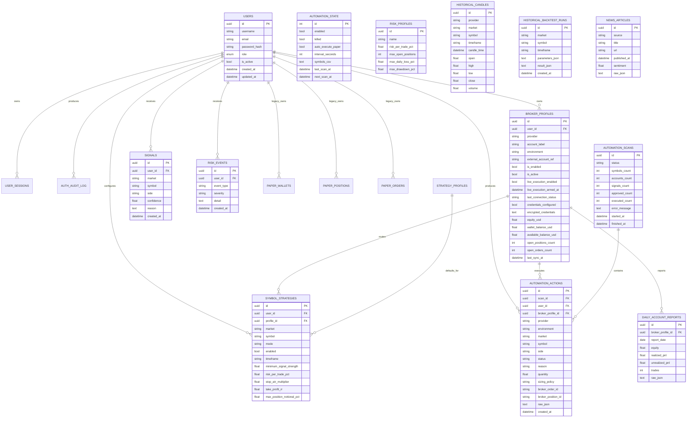

# ATLAS MARKETS — ERD

Last updated: 2026-08-30
Release line: v1.1 simulation / Oracle deployment preparation

This document describes the active PostgreSQL persistence model. Legacy ATLAS Paper tables remain for compatibility/history, but normal execution uses external provider accounts.

## Logical ERD

## Core ownership model

- `users` is the security/ownership root.
- `broker_profiles` stores provider/account configuration, encrypted credentials and synchronized account summary data.
- `symbol_strategies` maps each market/symbol to a broker profile and an operating mode: `WATCH`, `SIGNALS`, or `AUTO_TRADE`.
- `automation_scans` is the scan/cycle header.
- `automation_actions` is the persistent execution/safety ledger and carries broker order/position references plus raw evidence.

## Broker truth vs ATLAS truth

Provider-native fills, positions and P&L remain the authoritative broker truth. ATLAS persists the action lineage required to attribute future fills without inventing historical strategy ownership. Historical broker activity that predates verifiable action lineage is intentionally kept unverified.

## Legacy Paper entities

`paper_wallets`, `paper_positions`, and `paper_orders` remain in the database for migration/history compatibility. The active account model is `EXTERNAL_PROVIDERS_ONLY`; they must not be mistaken for Fusion Demo, IBKR Paper or Bybit Testnet activity.

## Oracle persistence

Oracle deployment continues to use PostgreSQL 17 in a private Docker network with a persistent Docker volume. PostgreSQL port 5432 and Redis port 6379 are not published publicly. Backups are custom-format `pg_dump` files stored outside Git.

See `ORACLE_DEPLOYMENT.md` for backup/restore and hosting topology.
