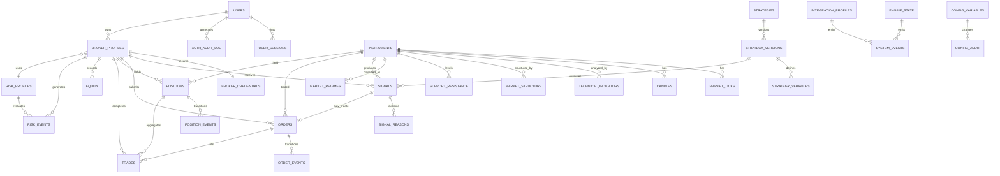

# Atlas Markets — PostgreSQL ERD

## Design principles

- Primary keys use UUID unless a high-volume time-series table benefits from bigint identity.
- All timestamps use `TIMESTAMPTZ` in UTC.
- Account-scoped trading records carry `profile_id` directly for isolation and indexing.
- Sensitive provider credentials are separated from normal broker-profile metadata.
- Strategy and risk configuration changes are versioned/audited.
- Provider external IDs are stored alongside internal IDs for reconciliation.

## Core ERD

## Table outline

### users
`id`, `username`, `password_hash`, `role`, `is_active`, `created_at`, `updated_at`, `last_login_at`

Constraints: unique username; role limited to ADMIN/USER.

### user_sessions
`id`, `user_id`, `token_hash`, `created_at`, `expires_at`, `revoked_at`, `ip_address`, `user_agent`

### auth_audit_log
`id`, `user_id`, `event_type`, `success`, `ip_address`, `metadata_json`, `created_at`

### broker_profiles
`id` (this is the logical `profile_id`), `user_id`, `provider`, `account_label`, `environment`, `external_account_ref`, `credential_fingerprint`, `is_enabled`, `last_connection_test_at`, `last_connection_status`, `created_at`, `updated_at`

Constraints: credential fingerprint unique where active; index `(user_id, is_enabled)`.

### broker_credentials
`id`, `profile_id`, `encrypted_json`, `key_version`, `updated_at`

No readable API key/secret columns.

### instruments
`id`, `provider`, `market_type`, `symbol`, `base_asset`, `quote_asset`, `price_precision`, `quantity_precision`, `min_quantity`, `contract_size`, `is_active`, `metadata_json`

Unique `(provider, market_type, symbol)`.

### market_ticks
`id`, `instrument_id`, `provider_ts`, `received_at`, `bid`, `ask`, `last`, `volume`, `sequence_no`

Time-series table with index `(instrument_id, provider_ts DESC)`; partitioning considered later based on volume.

### candles
`id`, `instrument_id`, `timeframe`, `open_time`, `close_time`, `open`, `high`, `low`, `close`, `volume`, `is_closed`, `source`

Unique `(instrument_id, timeframe, open_time)`.

### technical_indicators
`id`, `instrument_id`, `timeframe`, `candle_time`, `indicator_name`, `indicator_version`, `values_json`

### market_structure
`id`, `instrument_id`, `timeframe`, `candle_time`, `structure_class`, `bos`, `breakout`, `failed_breakout`, `details_json`

### support_resistance
`id`, `instrument_id`, `timeframe`, `detected_at`, `level_type`, `price`, `strength`, `details_json`

### signals
`id`, `profile_id`, `instrument_id`, `strategy_version_id`, `timeframe`, `decision`, `classification`, `score`, `risk_status`, `execution_status`, `created_at`

Indexes: `(profile_id, created_at DESC)`, `(instrument_id, created_at DESC)`.

### signal_reasons
`id`, `signal_id`, `reason_code`, `factor_score`, `details_json`

### orders
`id`, `profile_id`, `instrument_id`, `signal_id`, `provider`, `client_order_id`, `external_order_id`, `side`, `order_type`, `quantity`, `requested_price`, `stop_loss`, `take_profit`, `status`, `submitted_at`, `updated_at`

Unique `(profile_id, client_order_id)`; provider external ID indexed.

### order_events
`id`, `order_id`, `event_type`, `provider_status`, `filled_quantity`, `fill_price`, `payload_json`, `created_at`

### positions
`id`, `profile_id`, `instrument_id`, `provider_position_ref`, `side`, `quantity`, `entry_price`, `current_price`, `stop_loss`, `take_profit`, `trailing_stop`, `realized_pnl`, `unrealized_pnl`, `status`, `opened_at`, `closed_at`, `updated_at`

### position_events
`id`, `position_id`, `event_type`, `quantity`, `price`, `details_json`, `created_at`

### trades
`id`, `profile_id`, `position_id`, `order_id`, `instrument_id`, `external_trade_id`, `side`, `quantity`, `price`, `commission`, `funding`, `realized_pnl`, `executed_at`

### equity
`id`, `profile_id`, `recorded_at`, `balance`, `equity`, `available_balance`, `margin_used`, `unrealized_pnl`, `realized_pnl_day`

Index `(profile_id, recorded_at DESC)`.

### strategies
`id`, `name`, `description`, `is_active`, `created_at`

### strategy_versions
`id`, `strategy_id`, `version_no`, `status`, `definition_json`, `created_by`, `created_at`, `activated_at`

Unique `(strategy_id, version_no)`.

### strategy_variables
`id`, `strategy_version_id`, `name`, `value_json`, `data_type`

### risk_profiles
`id`, `name`, `risk_per_trade`, `max_daily_loss`, `max_weekly_loss`, `max_drawdown`, `max_open_positions`, `max_fx_exposure`, `max_crypto_exposure`, `max_leverage`, `max_spread`, `max_slippage`, `minimum_signal_score`, `cooldown_after_loss_seconds`, `max_consecutive_losses`, `config_json`, `version`, `is_active`, `created_at`

### risk_events
`id`, `profile_id`, `risk_profile_id`, `signal_id`, `event_type`, `approved`, `reason_code`, `metrics_json`, `created_at`

### market_regimes
`id`, `instrument_id`, `timeframe`, `candle_time`, `trend_regime`, `volatility_regime`, `confidence`, `details_json`

### news_events
`id`, `source`, `headline`, `event_time`, `symbols_json`, `sentiment`, `importance`, `payload_json`

Kept optional in initial implementation; architecture allows later market-news inputs.

### engine_state
`id`, `state`, `kill_switch_active`, `safe_mode_active`, `safe_mode_reason`, `updated_by`, `updated_at`

A single logical active row, guarded transactionally.

### system_events
`id`, `severity`, `component`, `event_type`, `profile_id`, `message`, `details_json`, `created_at`

### integration_profiles
`id`, `provider`, `name`, `environment`, `config_encrypted_json`, `is_enabled`, `last_test_at`, `last_test_status`, `created_at`, `updated_at`

### config_variables
`id`, `key`, `value_encrypted`, `is_secret`, `scope`, `updated_at`

### config_audit
`id`, `config_variable_id`, `changed_by`, `old_value_hash`, `new_value_hash`, `created_at`

## Isolation requirements

Account-scoped domain tables must use `profile_id`. All repository/service queries require an authorized profile scope. Admin bypass is explicit through authorization policy, not implicit omission of filters.

## Retention notes

`market_ticks` can become extremely large. The first production release should retain only the data needed for operational/reconciliation purposes while candles remain the principal historical analysis dataset. Partitioning and retention jobs can be activated when actual ingestion volume is known.
