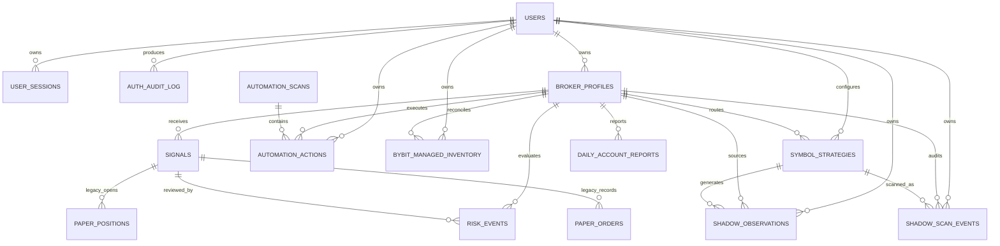
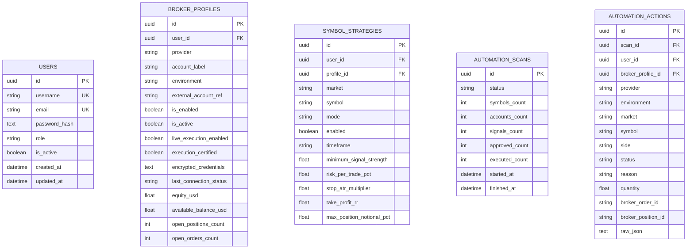
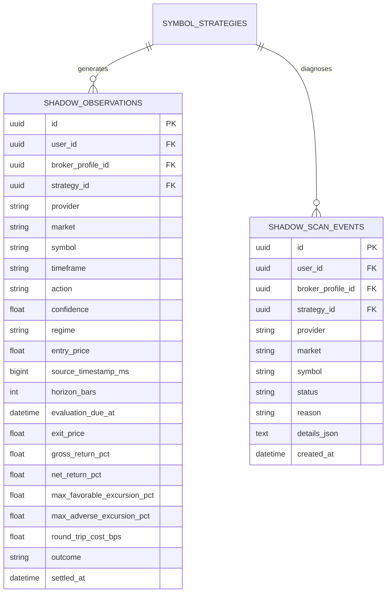

# ATLAS MARKETS v1 — Production ERD

Canonical baseline: `v1.0.0` at `5ef08db6426876be6019541c45c0b3b3851f85eb`

Database head: `20260925_0019`

Production database: `atlas_markets` (23 tables including `alembic_version`). The separate
`atlas` database on the Oracle host belongs to the earlier project and is not part of this ERD.

## Ownership and execution lineage

```mermaid
erDiagram
    USERS ||--o{ USER_SESSIONS : owns
    USERS ||--o{ AUTH_AUDIT_LOG : produces
    USERS ||--o{ BROKER_PROFILES : owns
    USERS ||--o{ SYMBOL_STRATEGIES : configures
    USERS ||--o{ AUTOMATION_ACTIONS : owns
    USERS ||--o{ BYBIT_MANAGED_INVENTORY : owns
    USERS ||--o{ SHADOW_OBSERVATIONS : owns
    USERS ||--o{ SHADOW_SCAN_EVENTS : owns

    BROKER_PROFILES ||--o{ SYMBOL_STRATEGIES : routes
    BROKER_PROFILES ||--o{ SIGNALS : receives
    BROKER_PROFILES ||--o{ RISK_EVENTS : evaluates
    BROKER_PROFILES ||--o{ AUTOMATION_ACTIONS : executes
    BROKER_PROFILES ||--o{ DAILY_ACCOUNT_REPORTS : reports
    BROKER_PROFILES ||--o{ BYBIT_MANAGED_INVENTORY : reconciles
    BROKER_PROFILES ||--o{ SHADOW_OBSERVATIONS : sources
    BROKER_PROFILES ||--o{ SHADOW_SCAN_EVENTS : audits

    SIGNALS ||--o{ RISK_EVENTS : reviewed_by
    SIGNALS ||--o{ PAPER_POSITIONS : legacy_opens
    SIGNALS ||--o{ PAPER_ORDERS : legacy_records
    AUTOMATION_SCANS ||--o{ AUTOMATION_ACTIONS : contains
    SYMBOL_STRATEGIES ||--o{ SHADOW_OBSERVATIONS : generates
    SYMBOL_STRATEGIES ||--o{ SHADOW_SCAN_EVENTS : scanned_as
```

## Entity catalogue

| Entity | Purpose | Key scope/relationship |
|---|---|---|
| `users` | Identity and ownership root | role is ADMIN or USER |
| `user_sessions` | Revocable sessions | user → many sessions |
| `auth_audit_log` | Authentication/security audit | optional user attribution |
| `broker_profiles` | Provider, environment, encrypted credentials, readiness and balance snapshot | user-owned |
| `strategy_profiles` | Global/default strategy parameters | shared defaults |
| `symbol_strategies` | Per-account instrument mode and overrides | unique user/profile/market/symbol |
| `automation_state` | Engine, kill switch, interval and universe | singleton by name |
| `automation_scans` | One automation-cycle header | parent of actions |
| `automation_actions` | Decision, block, submission and broker lineage | scan/user/profile linked |
| `signals` | BUY/SELL/HOLD analytical result | broker-profile scoped |
| `risk_profiles` | Risk defaults and portfolio limits | active configuration |
| `risk_events` | Approval/block evidence | profile and signal linked |
| `historical_candles` | Normalized OHLCV | unique market/symbol/interval/time |
| `historical_backtest_runs` | Historical validation summary | instrument/timeframe scoped |
| `news_articles` | News, symbol matching and sentiment | external ID unique |
| `daily_account_reports` | Daily equity/P&L operating report | unique profile/date |
| `bybit_managed_inventory` | ATLAS-owned Spot quantity and cost basis | unique profile/symbol |
| `shadow_observations` | Forward-only non-executable decisions and settled outcomes | strategy/source-bar unique |
| `shadow_scan_events` | Observed, skipped and error diagnostics | strategy/provider scoped |
| `paper_wallets` | Legacy internal paper wallet | one per profile |
| `paper_positions` | Legacy internal positions | optional signal lineage |
| `paper_orders` | Legacy internal order history | optional signal lineage |

## Core field groups

```mermaid
erDiagram
    USERS {
      uuid id PK
      string username UK
      string email UK
      text password_hash
      string role
      boolean is_active
      datetime created_at
      datetime updated_at
    }
    BROKER_PROFILES {
      uuid id PK
      uuid user_id FK
      string provider
      string account_label
      string environment
      string external_account_ref
      boolean is_enabled
      boolean is_active
      boolean live_execution_enabled
      boolean execution_certified
      text encrypted_credentials
      string last_connection_status
      float equity_usd
      float available_balance_usd
      int open_positions_count
      int open_orders_count
    }
    SYMBOL_STRATEGIES {
      uuid id PK
      uuid user_id FK
      uuid profile_id FK
      string market
      string symbol
      string mode
      boolean enabled
      string timeframe
      float minimum_signal_strength
      float risk_per_trade_pct
      float stop_atr_multiplier
      float take_profit_rr
      float max_position_notional_pct
    }
    AUTOMATION_SCANS {
      uuid id PK
      string status
      int symbols_count
      int accounts_count
      int signals_count
      int approved_count
      int executed_count
      datetime started_at
      datetime finished_at
    }
    AUTOMATION_ACTIONS {
      uuid id PK
      uuid scan_id FK
      uuid user_id FK
      uuid broker_profile_id FK
      string provider
      string environment
      string market
      string symbol
      string side
      string status
      string reason
      float quantity
      string broker_order_id
      string broker_position_id
      text raw_json
    }
```

## Shadow analytics

```mermaid
erDiagram
    SYMBOL_STRATEGIES ||--o{ SHADOW_OBSERVATIONS : generates
    SYMBOL_STRATEGIES ||--o{ SHADOW_SCAN_EVENTS : diagnoses

    SHADOW_OBSERVATIONS {
      uuid id PK
      uuid user_id FK
      uuid broker_profile_id FK
      uuid strategy_id FK
      string provider
      string market
      string symbol
      string timeframe
      string action
      float confidence
      string regime
      float entry_price
      bigint source_timestamp_ms
      int horizon_bars
      datetime evaluation_due_at
      float exit_price
      float gross_return_pct
      float net_return_pct
      float max_favorable_excursion_pct
      float max_adverse_excursion_pct
      float round_trip_cost_bps
      string outcome
      datetime settled_at
    }
    SHADOW_SCAN_EVENTS {
      uuid id PK
      uuid user_id FK
      uuid broker_profile_id FK
      uuid strategy_id FK
      string provider
      string market
      string symbol
      string status
      string reason
      text details_json
      datetime created_at
    }
```

`(strategy_id, source_timestamp_ms)` prevents duplicate observations for one strategy/source
bar. Shadow records are analytical evidence and never broker orders.

## Truth, deletion and storage rules

- Broker-native fills, positions, balances and P&L are authoritative broker truth.
- PostgreSQL is authoritative for ATLAS configuration, actions, audit and attribution.
- Strategy attribution requires matching persistent lineage; unmatched history is unverified.
- Export audit/financial evidence before destructive profile or user lifecycle actions.
- Redis is transient coordination/cache state, not a financial system of record.
- `paper_*` tables remain for compatibility and are not substitutes for Bybit Testnet, IBKR
  Paper or MT5 Demo broker state.
- Logical table families are not separate projects; declared foreign keys connect identity,
  provider, strategy, automation, reporting and shadow evidence.
- Verify `current_database()` and `alembic_version` before inspection or migration. See
  `DATABASE_OPERATIONS.md` for the canonical procedure.
