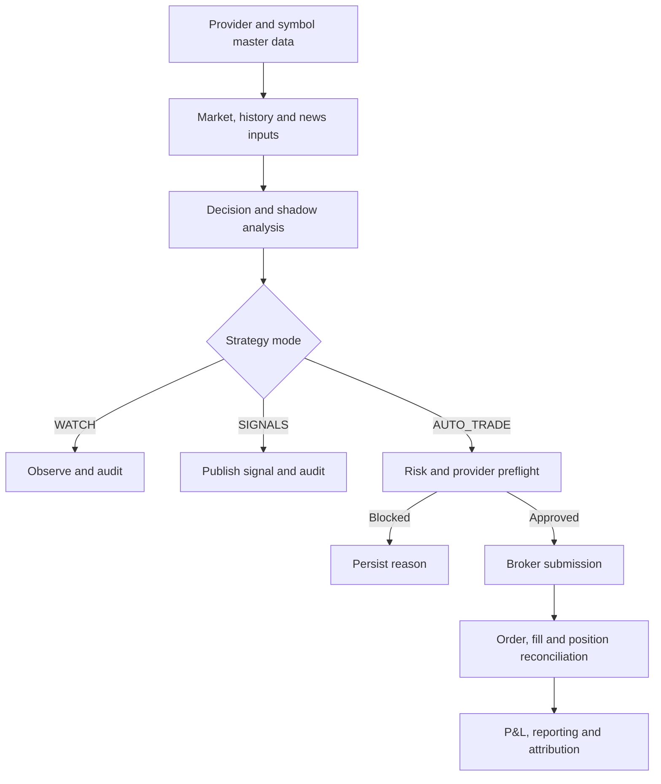

# ATLAS MARKETS v1 — ERP-Style Operating Model

ATLAS MARKETS is not a general accounting ERP. It applies ERP principles—master data,
segregated authority, controlled workflows, audit trails, reconciliation and reporting—to
multi-provider trading operations.

## Operating domains

| Domain | Master/transaction data | Owner | Control objective |
|---|---|---|---|
| Identity | users, sessions, auth audit | ADMIN | Only authorized people and roles operate the platform |
| Provider accounts | broker profiles and encrypted credentials | ADMIN | Each route has an owner, environment and certification state |
| Strategy master data | symbol strategies and strategy profiles | ADMIN | Every symbol has an explicit provider, mode and risk configuration |
| Decision processing | signals, shadow observations, scan events | System | Decisions retain evidence without implying execution |
| Risk approval | risk profiles and risk events | System/ADMIN | Execution is blocked unless every independent gate passes |
| Execution ledger | automation scans/actions and broker references | System | Every attempt has status, reason, quantity and provider evidence |
| Inventory | broker-native positions and Bybit managed inventory | Broker/System | ATLAS never invents holdings or sells unrelated inventory |
| Performance | daily reports, broker history and verified attribution | System | Broker truth remains separate from analytical and shadow results |

## End-to-end controlled workflow

## Segregation of duties

- `ADMIN` manages users, integrations, strategies, certification and automation controls.
- `USER` sees and operates only owned profiles and data permitted by the API.
- Analysis may recommend; it cannot bypass execution policy.
- Provider certification may enable a simulation route; it cannot enable Live Money.
- The kill switch prevents new automated submissions but does not silently liquidate holdings.

## Transaction states

An automation cycle creates one `automation_scans` header and zero or more
`automation_actions`. Actions distinguish observation, signal, approval, block, skip,
submission, execution, cancellation and error outcomes. A broker order identifier is evidence
of submission, not automatically proof of a fill. Fills and positions are reconciled against
the provider before performance is attributed.

## Reconciliation rules

1. Compare ATLAS actions with broker-native orders and fills.
2. Compare open positions and quantities with the broker.
3. For Bybit, cap managed inventory to available broker balance and exchange step size.
4. Treat unmatched historical broker activity as unverified.
5. Resolve discrepancies before restarting automation.
6. Record UTC timestamps, provider, environment, account and broker references.

## Period close and management reporting

Daily reporting records starting/ending equity, realized P&L, closed trades, wins, losses,
signals and approvals by provider profile. Operational review should also include unrealized
P&L, drawdown, rejected/cancelled orders, risk blocks, automation uptime and provider health.
Shadow performance is reported separately and never mixed with broker P&L.

## Change control

`DESIGN → BUILD → TEST → COMMIT → REVIEW → DEPLOY → SMOKE TEST → DOCUMENT → RELEASE`

Every deployment records the Git commit, image identifier, database revision and rollback
image. PostgreSQL/Redis and broker bridges are not restarted during an app-only deployment
unless the change explicitly requires it.

